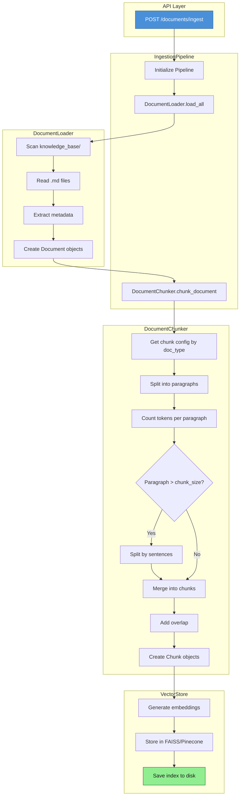

# Ingestion Pipeline

This document explains how documents are ingested into the vector store, from API call to searchable chunks.

## Overview

The ingestion pipeline transforms raw markdown documents into vectorized chunks that can be semantically searched.

---

## Complete Flow

