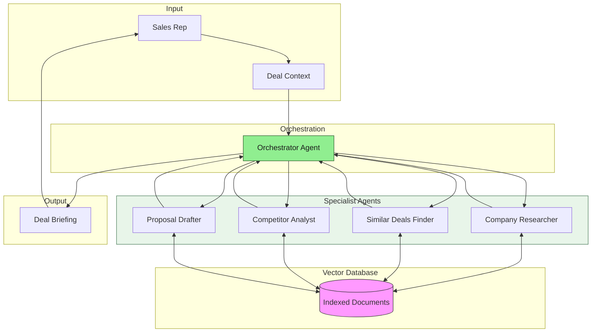

# Multi-Agent RAG System

A **production-oriented multi-agent AI system** designed for knowledge-driven automation, decision support, and consulting-grade workflows.

## Overview

This system implements:

- 🤖 **Multi-agent orchestration** — Specialist agents with clear responsibilities
- 🔍 **Retrieval-Augmented Generation (RAG)** — Context-aware responses from knowledge bases
- 🧠 **Vector databases & semantic memory** — FAISS (local) with hybrid search
- 📊 **Observability & cost control** — Token tracking, latency metrics

## Architecture



### Agents

| Agent | Responsibility |
|-------|----------------|
| **Orchestrator** | Coordinates workflow, synthesizes final briefing |
| **Company Researcher** | Finds industry insights, market context |
| **Similar Deals Finder** | Identifies past deals with similar characteristics |
| **Competitor Analyst** | Retrieves competitive positioning |
| **Proposal Drafter** | Generates customized talking points |

## Quick Start

### Prerequisites

- Python 3.11+
- [uv](https://github.com/astral-sh/uv) package manager
- OpenAI API key

### Installation

```bash
# Clone the repository
git clone https://github.com/yourusername/multi-agent-rag-system.git
cd multi-agent-rag-system

# Install dependencies
make install-dev

# Configure environment
cp .env.example .env
# Edit .env and add your OPENAI_API_KEY

# Run tests
make test

# Start development server
make dev
```

### API Endpoints

| Endpoint | Method | Description |
|----------|--------|-------------|
| `/health` | GET | Liveness check |
| `/status` | GET | Agent configuration and status |
| `/briefings` | POST | Generate a deal briefing |
| `/search` | POST | Direct semantic search |
| `/documents` | GET | List indexed documents |
| `/documents/ingest` | POST | Add documents to index |

### Example Request

```bash
curl -X POST http://localhost:8000/briefings \
  -H "Content-Type: application/json" \
  -d '{
    "company_name": "Acme Corp",
    "industry": "healthcare",
    "company_size": "mid-market",
    "meeting_type": "initial_call"
  }'
```

## Development

### Commands

```bash
make dev          # Start dev server with hot reload
make test         # Run tests
make install-dev  # Install with dev dependencies
make clean        # Clean cache files
```

## Design Philosophy

- **Agents have explicit and limited responsibilities**
- **Retrieval is intentional**, not automatic
- **Memory is selective and scoped**, not infinite
- **Automation is observable and auditable**
- **Costs, latency, and failure modes are first-class concerns**
- **Every architectural decision is explainable**
