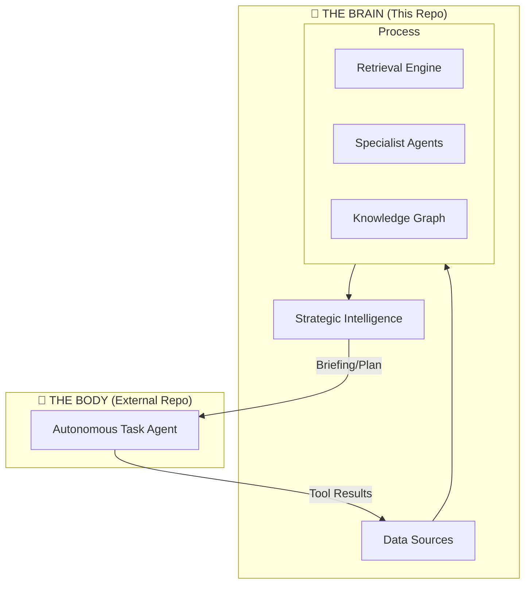

# Deal Intelligence Platform (The Brain)

**Role:** The Cognitive Engine
**Focus:** Understanding, Reasoning, Strategy

## Overview

This repository houses the **Cognitive Engine** of the ecosystem. Its primary purpose is to **understand** complex unstructured data (documents, sales calls, market briefings) and synthesize it into high-level strategic intelligence.

Unlike a simple chatbot, this system is designed to "deep think": it retrieves specific knowledge (`RAG`), orchestrates multiple specialist agents to debate and analyze (`Multi-Agent`), and produces structured insights.

> **Note:** This system does not *execute* changes in external systems (like sending emails or creating orders). That responsible execution is delegated to the **Autonomous Task Agent (The Body)**.

## Core Capabilities

1.  **Orchestration**: A central `OrchestratorAgent` that breaks down high-level questions ("How do we close this deal?") into research tasks.
2.  **Specialist Experts**:
    *   `CompanyResearcher`: Analyzes market position.
    *   `CompetitorAnalyst`: Finds gaps in rival offerings.
    *   `SimilarDealsFinder`: Recalls institutional memory.
3.  **Advanced RAG**:
    *   **Vector Search**: For finding relevant text chunks.
    *   **GraphRAG** (Roadmap): For understanding relationships between people and companies.
4.  **Multi-Modal Perception** (Roadmap):
    *   Ingesting Audio (Sales Calls) to understand sentiment.
    *   Ingesting Visuals (Slide Decks) to understand context.

## Architecture

```mermaid
flowchart TB
    subgraph Brain["🧠 THE BRAIN (This Repo)"]
        direction TB
        Input[Data Sources] --> Process[Cognitive Processing]
        Process --> Output[Strategic Intelligence]
        
        subgraph Process
            RAG[Retrieval Engine]
            Agents[Specialist Agents]
            Graph[Knowledge Graph]
        end
    end

    subgraph Body["💪 THE BODY (External Repo)"]
        TaskAgent[Autonomous Task Agent]
    end

    Output -->|Briefing/Plan| TaskAgent
    TaskAgent -->|Tool Results| Input
```

## documentation

- **[ROADMAP.md](ROADMAP.md)**: The project roadmap.
- **[USE_CASE.md](USE_CASE.md)**: The specific business value (Deal Intelligence).
- **[INGESTION_PIPELINE.md](INGESTION_PIPELINE.md)**: How data feeds the brain.
