# Deal Intelligence Platform

A **production-oriented multi-agent AI system** for knowledge-driven automation, decision support, and consulting-grade workflows.

## Overview

This platform provides sales teams with AI-powered deal preparation, combining:

- 🤖 **Multi-agent orchestration** — Specialist agents with clear responsibilities
- 🔍 **Retrieval-Augmented Generation (RAG)** — Context-aware responses from knowledge bases
- 🧠 **Vector databases** — FAISS (local) / Pinecone (managed) with semantic search
- 🎙️ **Voice analysis** — Meeting transcription and sentiment analysis
- 📊 **Interactive dashboards** — Streamlit-based analytics

## Architecture

```mermaid
flowchart TB
    subgraph Platform["DEAL INTELLIGENCE PLATFORM"]
        subgraph Docs["📄 DOCUMENTS ✅ Complete"]
            D1[Ingestion]
            D2[Chunking]
            D3[Retrieval]
            D4[Search]
        end
        
        subgraph Brief["📋 BRIEFINGS 🔜 Next"]
            B1[Orchestrator]
            B2[Specialists]
            B3[Synthesis]
        end
        
        subgraph Calls["🎙️ CALLS ⏳ Planned"]
            C1[Transcription]
            C2[Sentiment]
            C3[NER]
            C4[Topics]
        end
        
        subgraph Core["⚙️ CORE"]
            CONF[Config]
            LOG[Logging]
            BASE[Base Agent]
            SCH[Schemas]
        end
    end
    
    Docs --> Core
    Brief --> Core
    Calls --> Core
    
    style Docs fill:#c8e6c9,stroke:#2e7d32,color:#1b5e20
    style Brief fill:#fff3e0,stroke:#ef6c00,color:#e65100
    style Calls fill:#e3f2fd,stroke:#1976d2,color:#0d47a1
    style Core fill:#f3e5f5,stroke:#7b1fa2,color:#4a148c
```



### Agent Architecture


## Quick Start

### Prerequisites

- Python 3.11+
- [uv](https://github.com/astral-sh/uv) package manager
- OpenAI API key

### Installation

```bash
# Clone the repository
git clone https://github.com/yourusername/multi-agent-rag-system.git
cd multi-agent-rag-system

# Install dependencies
make install-dev

# Configure environment
cp .env.example .env
# Edit .env and add your OPENAI_API_KEY

# Run tests
make test

# Start development server
make dev

# Start dashboard (in a separate terminal)
make dashboard
```

## Design Philosophy

- **Feature-based organization** — Each module is self-contained
- **Agents have explicit and limited responsibilities**
- **Retrieval is intentional**, not automatic
- **Memory is selective and scoped**, not infinite
- **Pipeline steps are observable and debuggable**

## Related Documentation

- [INGESTION_PIPELINE.md](INGESTION_PIPELINE.md) — Document processing details
