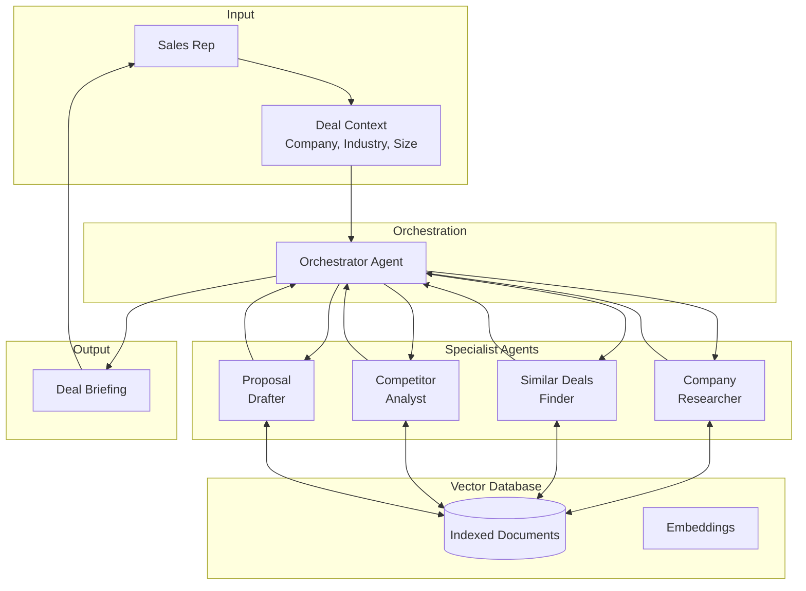

# Use Case: Deal Intelligence Platform

> A multi-agent RAG system that helps sales teams prepare for deals by synthesizing company knowledge, finding similar past deals, and generating actionable insights.

---

## Overview

**Project Name:** Deal Intelligence Platform  
**Type:** Multi-Agent RAG Automation System  
**Primary Value:** Accelerate deal preparation from hours to minutes  

### The Pitch

> "Before every sales call, your team spends 2-3 hours researching the prospect, finding similar deals, and preparing talking points. This platform does it in 2 minutes."

---

## Target User

| Attribute | Description |
|-----------|-------------|
| **Role** | Sales Representatives, Account Executives, Sales Managers |
| **Company Size** | Mid-market to Enterprise (50+ deals/quarter) |
| **Pain Point** | Too much time spent on manual research before sales calls |
| **Current Process** | Searching Slack, Confluence, Google Drive, CRM manually |

---

## Business Problem

### The Pain

1. **Knowledge is scattered** — Past deals, proposals, and insights live in 10+ different systems
2. **Institutional memory is lost** — When reps leave, their deal knowledge leaves with them
3. **Preparation is inconsistent** — Junior reps don't know what to look for
4. **Time is wasted** — 2-3 hours per deal on research that could be automated

### The Cost

| Metric | Before | After |
|--------|--------|-------|
| Deal prep time | 2-3 hours | 5 minutes |
| Knowledge utilization | ~20% of docs | ~90% of docs |
| Onboarding time | 3 months | 3 weeks |
| Prep quality consistency | Variable | Standardized |

---

## System Architecture

### High-Level Flow



### Agent Responsibilities

| Agent | Role | Vector DB Queries |
|-------|------|-------------------|
| **Orchestrator** | Coordinates workflow, synthesizes final briefing | Routes to specialists |
| **Company Researcher** | Finds industry insights, market context | "healthcare industry trends", "500 employee companies" |
| **Similar Deals Finder** | Identifies past deals with similar characteristics | "deals in healthcare", "mid-market contracts" |
| **Competitor Analyst** | Retrieves competitive positioning | "competitor X vs us", "objection handling" |
| **Proposal Drafter** | Generates customized talking points | "successful proposals healthcare", "pricing enterprise" |

---

## Vector Database Design

### Document Sources (Mock Data)

```
📁 knowledge_base/
├── 📂 deals/
│   ├── deal_001_acme_healthcare.md
│   ├── deal_002_globex_fintech.md
│   └── deal_003_initech_manufacturing.md
├── 📂 proposals/
│   ├── proposal_enterprise_template.md
│   ├── proposal_mid_market_template.md
│   └── proposal_startup_template.md
├── 📂 competitors/
│   ├── competitor_alpha_analysis.md
│   ├── competitor_beta_analysis.md
│   └── objection_handling_guide.md
├── 📂 products/
│   ├── product_overview.md
│   ├── pricing_guide.md
│   └── feature_comparison.md
├── 📂 industries/
│   ├── healthcare_playbook.md
│   ├── fintech_playbook.md
│   └── manufacturing_playbook.md
└── 📂 case_studies/
    ├── case_study_acme.md
    ├── case_study_globex.md
    └── case_study_initech.md
```

### Chunking Strategy

| Document Type | Chunk Size | Overlap | Rationale |
|---------------|------------|---------|-----------|
| Deals | 1000 tokens | 200 | Preserve deal context |
| Proposals | 500 tokens | 100 | Granular section retrieval |
| Competitors | 800 tokens | 150 | Keep comparison context |
| Products | 500 tokens | 100 | Feature-level retrieval |

### Metadata Schema

```python
{
    "doc_id": "deal_001",
    "doc_type": "deal",           # deal, proposal, competitor, product, case_study
    "industry": "healthcare",
    "company_size": "mid-market", # startup, mid-market, enterprise
    "deal_value": 50000,
    "outcome": "won",             # won, lost, pending
    "date": "2025-06-15",
    "tags": ["saas", "annual", "multi-year"]
}
```

### Search Patterns

| Query Type | Search Method | Filters |
|------------|---------------|---------|
| Similar deals | Semantic + metadata | industry, company_size, outcome=won |
| Competitor info | Semantic | doc_type=competitor |
| Pricing guidance | Semantic + metadata | doc_type=product, tags contains "pricing" |
| Industry playbook | Metadata first | industry, doc_type=industry |

---

## System Inputs & Outputs

### Input: Deal Context

```json
{
    "company_name": "Acme Corp",
    "industry": "healthcare",
    "company_size": "mid-market",
    "employee_count": 500,
    "deal_stage": "discovery",
    "meeting_type": "initial_call",
    "specific_questions": [
        "What similar deals have we closed?",
        "How do we compare to Competitor X?"
    ]
}
```

### Output: Deal Briefing

```json
{
    "company_summary": {
        "overview": "Acme Corp is a mid-market healthcare company...",
        "industry_context": "Healthcare sector is prioritizing...",
        "sources": ["industries/healthcare_playbook.md"]
    },
    "similar_deals": [
        {
            "company": "MedTech Inc",
            "similarity_score": 0.92,
            "outcome": "won",
            "deal_value": 75000,
            "key_learnings": "Emphasized compliance features...",
            "source": "deals/deal_005_medtech.md"
        }
    ],
    "competitive_positioning": {
        "vs_competitor_x": "We excel in..., they excel in...",
        "objection_responses": [...],
        "sources": ["competitors/competitor_x_analysis.md"]
    },
    "recommended_approach": {
        "talking_points": [...],
        "questions_to_ask": [...],
        "pricing_guidance": "Based on similar deals, target $50-75K ARR",
        "sources": ["proposals/proposal_mid_market_template.md"]
    },
    "metadata": {
        "generated_at": "2026-01-04T10:30:00Z",
        "documents_searched": 45,
        "documents_cited": 8,
        "confidence_score": 0.87
    }
}
```

---

## API Endpoints

### Core Endpoints

| Method | Endpoint | Description |
|--------|----------|-------------|
| `POST` | `/briefings` | Generate a new deal briefing |
| `GET` | `/briefings/{id}` | Retrieve a generated briefing |
| `POST` | `/search` | Direct semantic search |
| `GET` | `/documents` | List indexed documents |
| `POST` | `/documents/ingest` | Add new documents to index |

### Example Request

```bash
curl -X POST http://localhost:8000/briefings \
  -H "Content-Type: application/json" \
  -d '{
    "company_name": "Acme Corp",
    "industry": "healthcare",
    "company_size": "mid-market",
    "meeting_type": "initial_call"
  }'
```

---

## Tools (Mock Implementations)

### Tool Registry

| Tool | Description | Simulates |
|------|-------------|-----------|
| `vector_search` | Semantic search across knowledge base | FAISS/Pinecone query |
| `metadata_filter` | Filter documents by metadata | Database query |
| `document_retrieve` | Fetch full document content | Document store |
| `embedding_generate` | Generate embeddings for text | OpenAI embeddings API |
| `crm_lookup` | Get deal/company info from CRM | HubSpot/Salesforce API |
| `summarize` | Summarize long documents | LLM call |

### Tool Interfaces

```python
# tools/vector_search.py
class VectorSearchTool(BaseTool):
    name = "vector_search"
    description = "Search the knowledge base using semantic similarity"
    
    class InputSchema(BaseModel):
        query: str = Field(..., description="Search query")
        top_k: int = Field(default=5, description="Number of results")
        filters: dict | None = Field(default=None, description="Metadata filters")
    
    def execute(self, params: dict) -> ToolResult:
        # Mock implementation - returns simulated search results
        return ToolResult(
            success=True,
            data={
                "results": [
                    {
                        "doc_id": "deal_005",
                        "content": "MedTech Inc deal closed at $75K...",
                        "score": 0.92,
                        "metadata": {"industry": "healthcare", "outcome": "won"}
                    }
                ],
                "total_searched": 45
            }
        )
```

---

## System Boundaries

### In Scope

- ✅ Semantic search across indexed documents
- ✅ Multi-agent orchestration for briefing generation
- ✅ Document ingestion and chunking
- ✅ Metadata filtering and hybrid search
- ✅ Citation tracking (which docs were used)
- ✅ Mock tool implementations

### Out of Scope

- ❌ Real CRM integration (HubSpot/Salesforce)
- ❌ Real-time document sync
- ❌ User authentication/authorization
- ❌ Multi-tenancy
- ❌ Production vector database (Pinecone/Weaviate cloud)
- ❌ Document OCR/parsing (assume clean markdown)

---

## Non-Goals

1. **Not a CRM replacement** — This augments CRM, doesn't replace it
2. **Not a document management system** — We search, not store/organize
3. **Not real-time** — Briefings are generated on-demand, not streaming
4. **Not a chatbot** — Structured output, not conversational

---

## Technical Risks

| Risk | Likelihood | Impact | Mitigation |
|------|------------|--------|------------|
| Poor retrieval quality | Medium | High | Tune chunk size, use hybrid search |
| Agent hallucination | Medium | High | Require citations, validate sources |
| Slow generation | Low | Medium | Parallel agent execution |
| Context window overflow | Medium | Medium | Smart summarization, chunking |

---

## Success Metrics

### For Portfolio Demonstration

| Metric | Target | How to Measure |
|--------|--------|----------------|
| Vector search accuracy | >85% relevant results | Manual evaluation on test queries |
| Briefing quality | Cites correct sources | Source verification |
| Multi-agent coordination | All 4 agents contribute | Check briefing sections |
| Response time | <30 seconds | API timing |
| Code quality | Passing tests, typed | pytest, mypy |

### For Production (Hypothetical)

| Metric | Target | Business Impact |
|--------|--------|-----------------|
| Deal prep time reduction | 80% | Hours saved per rep |
| Document utilization | 5x increase | Better knowledge leverage |
| Rep satisfaction | >4.5/5 | Tool adoption |
| Deal win rate | +10% | Revenue impact |

---

## Implementation Phases

### Phase 1: Foundation (Week 1)
- [ ] Project setup (FastAPI, Pydantic, uv)
- [ ] Vector database integration (FAISS local)
- [ ] Document ingestion pipeline
- [ ] Basic semantic search endpoint

### Phase 2: Agents (Week 2)
- [ ] Base agent architecture
- [ ] Orchestrator agent
- [ ] Specialist agents (4)
- [ ] Tool registry and dispatch

### Phase 3: RAG Pipeline (Week 3)
- [ ] Multi-query retrieval
- [ ] Hybrid search (semantic + metadata)
- [ ] Citation tracking
- [ ] Context assembly

### Phase 4: API & Polish (Week 4)
- [ ] Briefing generation endpoint
- [ ] Document management endpoints
- [ ] Error handling and logging
- [ ] Documentation and tests

---

## Sample Documents (Mock Data)

### deals/deal_005_medtech.md

```markdown
# Deal: MedTech Inc

## Overview
- **Company:** MedTech Inc
- **Industry:** Healthcare
- **Size:** Mid-market (450 employees)
- **Deal Value:** $75,000 ARR
- **Outcome:** Won
- **Close Date:** 2025-08-15

## Key Success Factors
1. Emphasized HIPAA compliance features
2. Provided healthcare-specific case studies
3. Offered flexible payment terms
4. Executive sponsor engaged early

## Objections Overcome
- "Your competitor has more healthcare clients" → Showed our compliance certifications
- "Budget is tight this quarter" → Offered quarterly billing

## Lessons Learned
Healthcare deals require compliance documentation upfront. Always lead with security.
```

### competitors/competitor_alpha.md

```markdown
# Competitor Analysis: Alpha Corp

## Overview
Direct competitor in the mid-market segment.

## Strengths
- Lower price point (~20% cheaper)
- Faster implementation (2 weeks vs our 4 weeks)
- Strong brand recognition in fintech

## Weaknesses
- No HIPAA compliance (critical for healthcare)
- Limited API capabilities
- Poor customer support ratings

## How We Win Against Alpha
1. **Healthcare:** Lead with compliance, they can't compete
2. **Enterprise:** Our API flexibility wins
3. **Price-sensitive:** Emphasize TCO, not just license cost

## Common Objections
- "Alpha is cheaper" → Calculate 3-year TCO including support costs
- "Alpha is faster to implement" → Speed vs. doing it right
```

---

## Why This Use Case

### For the Job Posting

> ✅ "Diseñar, desarrollar y desplegar agentes de IA autónomos"

Multi-agent system with orchestration

> ✅ "Integrar agentes con herramientas de automatización, APIs"

Tool registry with mock CRM, vector search tools

> ✅ "Implementar y optimizar bases de datos vectoriales"

FAISS implementation with chunking, hybrid search

> ✅ "Búsquedas semánticas y memoria contextual"

Core feature - semantic search powers everything

> ✅ "Documentar arquitecturas y soluciones"

This document + ARCHITECTURE.md

---

## Related

- [P1: Autonomous Task Agent](../README.md) — Foundation patterns
- [Architecture](./ARCHITECTURE.md) — System design details
